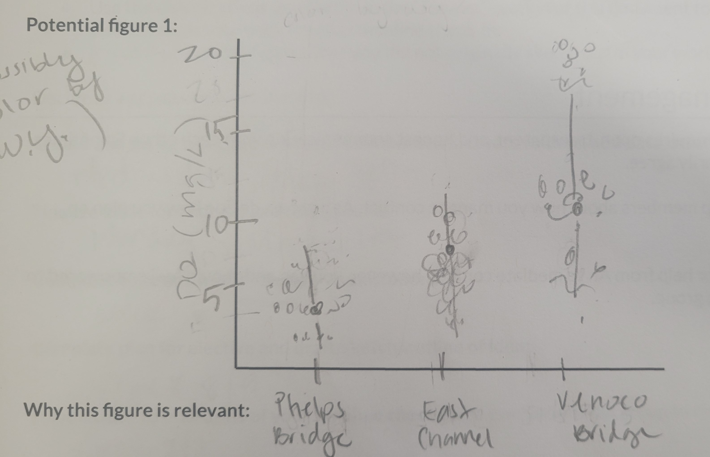
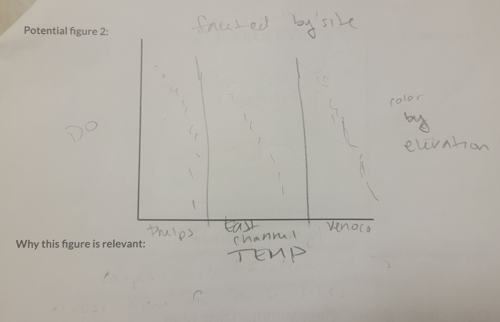
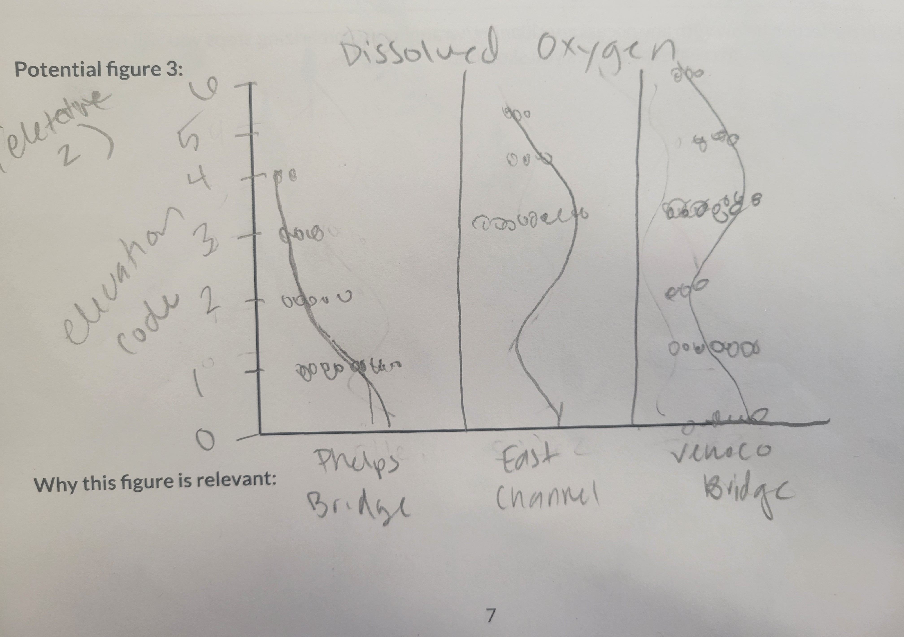

# Group project proposal

**Spring 2026**

Directions:

- Use your work plan from class to fill in the information below.
- Practice pulling, making changes, staging/committing/pulling/pushing to the same repo.
- **Communicate about who is doing what throughout the entire process.**

What you will submit on Friday the 15th:

- [proposal](https://github.com/shucanzhao/ENVS-193DD-Final_Project): a link to your forked repository with the completed proposal in the README
- work plan: your paper plan that you completed in class on Monday the 4th

Use your project proposal to:

- refer back to the original plan while you are working
- keep track of high-level changes in structure (e.g. role switching, elective modifications)

Note:

- your project proposal is subject to change after you learn more about your datasets and what is possible - allow yourselves the flexibility to make adjustments as needed
- the more detail you can provide in your proposal, the more thorough your feedback will be

## Group members

Phoebe Dupa, Rebecca Martinez, Shucan Zhao

## Group name (optional):

Water Warriors

## Topic information and question

**Topic:**  

Hydrology/Water Quality

**Question(s):**  

- How does dissolved oxygen (DO) differ across sites?
- How does stratification differ across sites?

**Response variable(s)**

- Dissolved Oxygen (DO)
- Elevation
- Temperature

## Datasets

**Datasets used:**

- weather data from NOAA station: `NOAA-weather-data.csv`
- metadata containing site and survey information: `NCOS_YSI_Water_Quality_Monitoring_0.csv`
- water quality parameter measurements (salinity, temperature, etc.): `YSI_Data_Begin_1.csv`

## Figures

**Potential figure 1:**

This figure will compare dissolved oxygen measurements across the three main NCOS sites.

- x-axis: `site_full`
- y-axis: `do_mg_l`
- `filter(!is.na(do_mg_l))` to remove missing DO values
- `ggplot()` to create the plot
- `aes(x = site_full, y = do_mg_l)` to map the variables
- `geom_jitter()` to show individual observations
- `stat_summary(fun = median, geom = "point")` to show the median DO for each site
- `labs()` to label the plot
- `theme_bw()` to use a clean theme

.

This figure will help answer whether some sites have higher or lower dissolved oxygen overall.

**Potential figure 2:**

This figure will compare dissolved oxygen measurements across elevation codes at each site.

- x-axis: `elevation_code`
- y-axis: `do_mg_l`
- panels: `site_full`
- `filter(!is.na(do_mg_l), !is.na(elevation_code))` to remove missing DO and elevation values
- `ggplot()` to create the plot
- `aes(x = elevation_code, y = do_mg_l)` to map the variables
- `geom_point()` or `geom_jitter()` to show individual observations
- `stat_summary(fun = median, geom = "point")` to show median DO at each elevation code
- `stat_summary(fun = median, geom = "line")` to connect median DO values across elevation codes
- `facet_wrap(~ site_full)` to compare sites
- `coord_flip()` to make the plot look more like an elevation profile
- `labs()` to label the plot
- `theme_bw()` to use a clean theme

.

This figure will help answer whether dissolved oxygen changes across elevation codes and whether some sites show stronger stratification.

**Potential figure 2:**

### Potential figure 2: Dissolved oxygen and water temperature

This figure will compare dissolved oxygen with water temperature across sites.

- x-axis: `temperature_c`
- y-axis: `do_mg_l`
- color: `elevation_code`
- panels: `site_full`
- `filter(!is.na(do_mg_l), !is.na(temperature_c))` to remove missing DO and temperature values
- `ggplot()` to create the plot
- `aes(x = temperature_c, y = do_mg_l, color = elevation_code)` to map the variables
- `geom_point()` to show individual observations
- `facet_wrap(~ site_full)` to compare sites
- `labs()` to label the plot
- `theme_bw()` to use a clean theme

This figure will help us see whether dissolved oxygen may be related to water temperature.

**Potential figure 3:**

This figure will compare dissolved oxygen measurements across elevation codes at each site.

- x-axis: `elevation_code`
- y-axis: `do_mg_l`
- panels: `site_full`
- `filter(!is.na(do_mg_l), !is.na(elevation_code))` to remove missing DO and elevation values
- `ggplot()` to create the plot
- `aes(x = elevation_code, y = do_mg_l)` to map the variables
- `geom_point()` or `geom_jitter()` to show individual observations
- `stat_summary(fun = median, geom = "point")` to show median DO at each elevation code
- `stat_summary(fun = median, geom = "line")` to connect median DO values across elevation codes
- `facet_wrap(~ site_full)` to compare sites
- `coord_flip()` to make the plot look more like an elevation profile
- `labs()` to label the plot
- `theme_bw()` to use a clean theme

.

This figure will help answer whether dissolved oxygen changes across elevation codes and whether some sites show stronger stratification.

### Data cleaning/wrangling/summarizing plan

Our project will use the same general workflow from previous assignments (especially week 3), but the analysis will be focused on dissolved oxygen (DO) instead of salinity.

#### 1. Read in the data

- Load packages with `library(tidyverse)`, `library(janitor)`, `library(lubridate)`, and `library(here)`
- Read in the NOAA weather data with `read_csv(here("data", "NOAA-weather-data.csv"))`
- Read in the water quality metadata with `read_csv(here("data", "NCOS_YSI_Water_Quality_Monitoring_0.csv"))`
- Read in the water parameter data with `read_csv(here("data", "YSI_Data_Begin_1.csv"))`

#### 2. Clean the metadata

- Start with the original metadata dataset
- Use `clean_names()` to clean column names
- Use `select()` to remove unnecessary columns, such as `object_id`
- Use `mutate()` and `mdy_hms()` to convert `monitoring_date` into a date-time format
- Use `mutate()` with `month()` and `year()` to create month and year columns
- Use `mutate()` with `case_when()` to create a water year column called `wy`
- Use `mutate()` with `case_when()` to create readable site names in a new column called `site_full`
- Use `filter()` to remove observations from `Other` sites
- Save the cleaned object as `metadata_clean`

#### 3. Clean the water parameter data

- Start with the original water parameter dataset
- Use `clean_names()` to clean column names
- Use `select()` to remove unnecessary columns, such as `creator` and `editor`
- Use `rename()` to rename `depth_code` as `elevation_code`
- Use `mutate()` with `case_when()` to correct `elevation_code == 10` to `1`, if needed
- Use `mutate()` with `as_factor()` to treat `elevation_code` as categorical
- Use `fct_relevel()` to order elevation codes from `0` to `6`
- Use `select()` to keep variables needed for the project, including `parent_global_id`, `elevation_code`, `do_mg_l`, `do_percent_sat`, `temperature_c`, and `salinity_ppt`
- Save the cleaned object as `water_parameters_clean`

#### 4. Join the metadata and water parameter data

- Start with `metadata_clean` and `water_parameters_clean`
- Use `full_join()` or `left_join()` to join the datasets
- Match `global_id` from the metadata with `parent_global_id` from the water parameter data
- Use `select()` to keep the columns needed for the project
- Use `mutate()` and `date()` to create a date column from the monitoring datetime column
- Save the joined object as `water_quality`

#### 5. Filter the joined dataset

- Start with `water_quality`
- Use `filter()` to keep only the three main NCOS sites
- Use `filter(!is.na(do_mg_l))` to remove missing DO values
- Decide whether to focus on one water year, such as `filter(wy == 2024)`, or include multiple years
- Decide which elevation codes to include using `filter(elevation_code %in% c(...))`
- Check for unusual or extreme DO values using summaries or exploratory plots
- Save the filtered object as `do_filtered`

#### 6. Summarize dissolved oxygen across sites

- Start with `do_filtered`
- Use `group_by(site_full)` to group observations by site
- Use `summarize()` to calculate:
  - mean DO with `mean(do_mg_l, na.rm = TRUE)`
  - median DO with `median(do_mg_l, na.rm = TRUE)`
  - standard deviation with `sd(do_mg_l, na.rm = TRUE)`
  - number of observations with `n()`
- Save the summary as `do_site_summary`

This summary will help answer how dissolved oxygen differs across sites.

#### 7. Summarize dissolved oxygen by elevation code and site

- Start with `do_filtered`
- Use `group_by(site_full, elevation_code)` to group observations by site and elevation code
- Use `summarize()` to calculate:
  - mean DO with `mean(do_mg_l, na.rm = TRUE)`
  - median DO with `median(do_mg_l, na.rm = TRUE)`
  - number of observations with `n()`
- Save the summary as `do_elevation_summary`

This summary will help answer whether dissolved oxygen changes across elevation codes and whether those changes suggest stratification.

#### 8. Create Figure 1: Dissolved oxygen across sites

- Start with `do_filtered`
- Use `ggplot()` to create the plot
- Use `aes(x = site_full, y = do_mg_l)` to map site and DO
- Use `geom_jitter()` to show individual DO observations
- Use `stat_summary(fun = median, geom = "point")` to show the median DO for each site
- Use `labs()` to label the axes and title
- Use `theme_bw()` for a clean theme

This figure will answer whether some sites tend to have higher or lower dissolved oxygen overall.

#### 9. Create Figure 2: Dissolved oxygen and water temperature

- Start with `do_filtered`
- Use `filter(!is.na(temperature_c))` to remove missing temperature values
- Use `ggplot()` to create the plot
- Use `aes(x = temperature_c, y = do_mg_l, color = elevation_code)` to map temperature, DO, and elevation code
- Use `geom_point()` to show individual observations
- Use `facet_wrap(~ site_full)` to compare sites
- Use `labs()` to label the axes, title, and legend
- Use `theme_bw()` for a clean theme

This figure will help us see whether lower dissolved oxygen values are associated with warmer water temperatures.

#### 10. Create Figure 3: Dissolved oxygen elevation profile

- Start with `do_filtered`
- Use `filter(!is.na(elevation_code))` to remove missing elevation values
- Use `ggplot()` to create the plot
- Use `aes(x = elevation_code, y = do_mg_l, group = 1)` to map elevation code and DO
- Use `geom_point()` or `geom_jitter()` to show individual DO observations
- Use `stat_summary(fun = median, geom = "point")` to show median DO at each elevation code
- Use `stat_summary(fun = median, geom = "line")` to connect median DO values across elevation codes
- Use `facet_wrap(~ site_full)` to compare sites
- Use `coord_flip()` to make the plot look more like an elevation profile
- Use `labs()` to label the axes and title
- Use `theme_bw()` for a clean theme

This figure will answer whether dissolved oxygen changes by elevation code within each site and whether some sites show stronger stratification than others.

#### 11. Interpret results

- Compare median and mean DO across sites
- Identify which site has the highest or lowest DO
- Look for differences in DO variability across sites
- Compare DO across elevation codes within each site
- Decide whether elevation patterns suggest stratification or mixing
- Use temperature or salinity patterns to help explain DO patterns, if useful
- Connect the interpretation back to the research questions

## Project roles

**Natural history/framing director:**

Phoebe Dupa

**Stats and visualization director**

Rebecca Martinez

**GitHub/code director**

Shucan Zhao

## Elective (not required for all groups or group members)

**Group members completing elective:**

Rebecca Martinez, Phoebe Dupa, Shucan Zhao

**Elective idea:**

3 clear containers (representing each site) with layers (of possible different colored sand) with clear or blue marbles or similar to show DO stratification at each site.

**Elective timeline (what you will have completed each week):**

Week 7: 
- have close to final draft of timeline check in for everyone in group to review

Week 8 (timeline check in): 
- turn in timeline check in
- finalize ideas for analysis and background

Week 9: 
- complete plan for elective and draft/sketch/outline of idea

Week 10: 
- complete code and interpretation visualizations
- complete advanced elective

Finals week: 
- present

